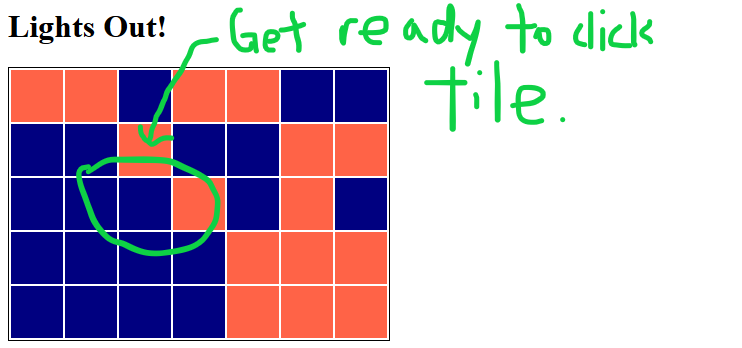
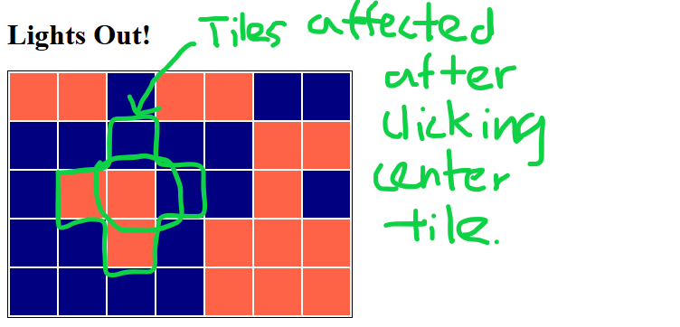

# Lights_Out_Browser_Game

## To run this game:

1. Visit online tools for testing HTML/CSS/JavaScript like [JSFiddle](https://jsfiddle.net/) and [CodePen](https://codepen.io/pen/).

2. Copy and paste contents of present HTML, CSS and JavaScript files into the corresponding text boxes.

3. Either hit the "run" button or the website will automatically run the pasted JavaScript code (along with the HTML and CSS).

4. You should see a rendered board of various blue and orange tiles arranged randomly on your browser.

5. Now you are ready to play!

## How to play this game:

1. When page first loads, you will see a randomized board of blue and orange tiles. Orange tiles indicate that they are "on" while blue tiles indicate they are "off".

2. Click on a tile to flip the state of the tile you clicked on including 1 tile to the north, west, south, and east.

3. You win the game when all tiles have been turned "off".

## Screenshots of using CodePen to run game:

### Example Initial Board Setup:

### After Clicking a Tile:

